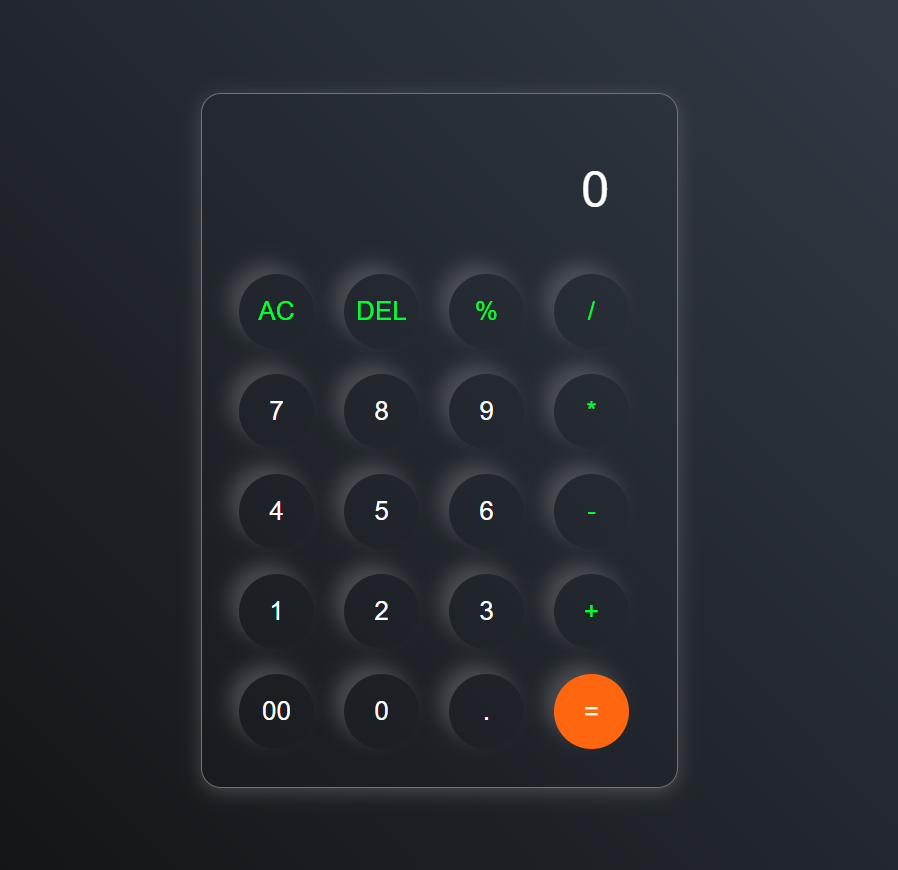

# Calculator Project

This is a simple Calculator application built using HTML, CSS, and JavaScript.

## Table of Contents

- [Features](#features)
- [Technologies Used](#technologies-used)
- [Installation](#installation)
- [Usage](#usage)
- [Contributing](#contributing)
- [Screenshot](#screenshot)
- [Contact](#contact)

## Features

- Perform basic arithmetic operations: addition, subtraction, multiplication, and division.
- User-friendly interface.
- Responsive design for different screen sizes.

## Technologies Used

- **HTML**: For creating the structure of the calculator.
- **CSS**: For styling the calculator and making it visually appealing.
- **JavaScript**: For implementing the functionality of the calculator.

## Installation

1. Clone the repository to your local machine:
   ```bash
   git clone https://github.com/your-username/calculator.git
   ```

2. Navigate to the project directory:
   ```bash
   cd calculator
   ```

3. Open the `index.html` file in your preferred web browser to use the calculator.

## Usage

1. Enter numbers and select operations using the buttons provided.
2. The result will be displayed on the screen after pressing the equals (`=`) button.
3. Clear the input using the `C` button.

## Contributing

Contributions are welcome! If you have any ideas or suggestions to improve this project, please:

1. Fork the repository.
2. Create a new branch:
   ```bash
   git checkout -b feature-name
   ```
3. Commit your changes:
   ```bash
   git commit -m "Add some feature"
   ```
4. Push to the branch:
   ```bash
   git push origin feature-name
   ```
5. Open a Pull Request.

## Screenshot



## Contact

For any questions or suggestions, feel free to contact:

- **Email**: [shreyakmukherjee143@gmail.com](mailto:shreyakmukherjee143@gmail.com)
- **GitHub**: [shreyakmukherjee](https://github.com/shreyakmukherjee)
